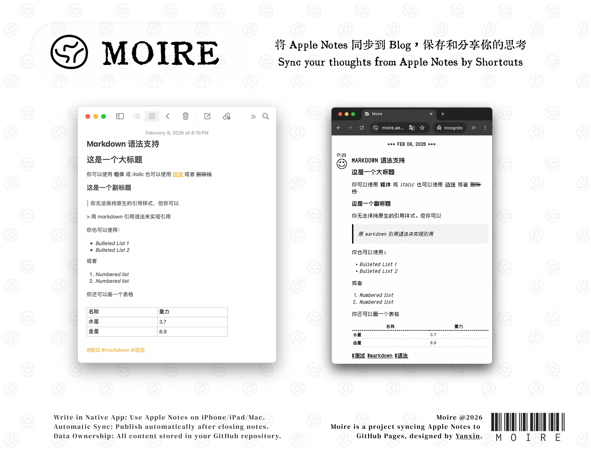

# Markdown Syntax Supported by Moire

## h1 Heading  
  
### h2 Heading  
  

_italic_  or  **bold** or  ~~Strikethrough~~

> This is a blockquote with long text. This is a blockquote with long text. This is a blockquote.
  
This is a [link](https://docs.moire.blog). This is a `code`

What to do this week?

- [ ] TODO 1
  - [x] TODO 1.1
    - [ ] TODO 1.1.1
- [x] TODO 1

You can use：

- Bulleted List 1
- Bulleted List 2

Or:

1. Numbered list
2. Numbered list

| **Option** | **Description** |  
|---|---|  
| data | supply the data that will be passed into templates.|  
| ext | extension to be used for dest files.|  

